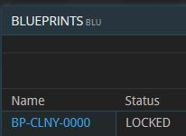
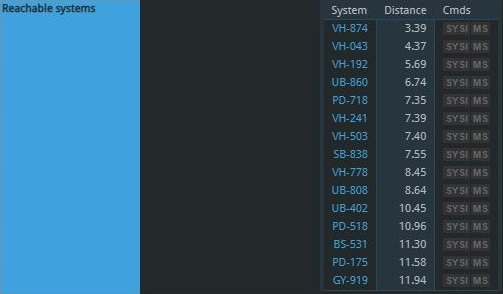
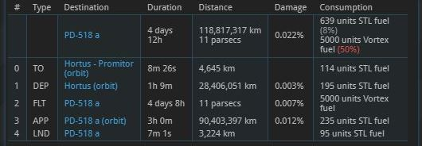

## Blueprint

A colony ship is a special kind of ship with a pre-determined blueprint that every player has in ther list of blueprints (BLU) by default, similar to the starter ship blueprint. It starts in the "LOCKED" status, so colony ships can only ever be constructed using this exact blueprint.

A major difference when compared to regular ships, is that colony ships do not have an FTL reactor or FTL fuel tank, but instead use a special type of engine called **Vortex engine**.

## Space travel

A colony ship's Vortex engine allows it to travel to nearby systems independently from FTL connections. This means *even if there is no FTL connection* between systems A and B, a colony ship will still be able to travel between them if the target system is not too distant from the ship.

In a colony ship's flight controls (SFC), before entering a target destination, you will be able to see all the systems within its reach. Use this list to determine a target planet to enter that lies within one of these systems.

STL flight for colony ships works in the exact same way as for any other ship. However, in place of the usual FTL-related steps, its flight plan will include a "floating" step (FLO). This step will always take multiple days to complete (longer for greater distances) and will always use a set amount of Vortex fuel units.

## Purpose
Please note that colony ships are not meant to be a regular, efficient way of moving goods around between systems. Instead, they will situationally be useful to bridge gaps in the universe's FTL network, either by making entirely detached sectors accessible, or by offering a way around particularly long detours (at least in case the price of the required Vortex fuel is favorable enough).

{}